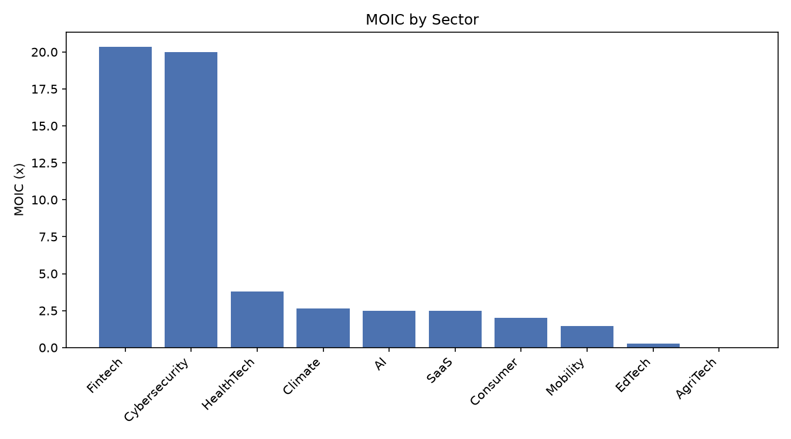
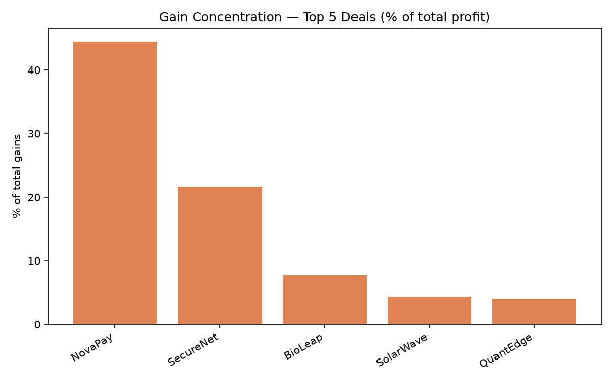
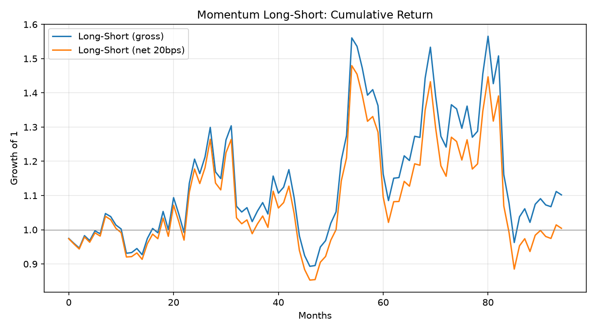
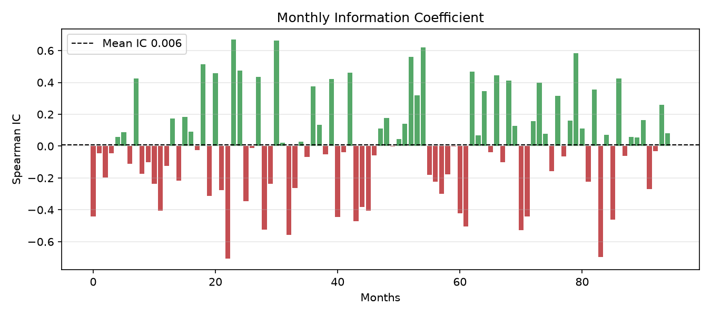

# SQL Financial Analytics

Two SQL (SQLite) analytics projects demonstrating schema design with constraints,
JOINs, CTEs, window functions and custom aggregates — applied to private-markets
and quantitative use cases. All data is either **simulated** (PE/VC) or public
market data (quant); neither project is a validated investment strategy.

## 1. Simulated PE/VC Portfolio Analytics (`pe_vc_deals.py`)
A SQLite database of a **fictional** PE/VC fund portfolio, with fund-level and
deal-level analytics.

- Fund metrics: paid-in, **DPI / RVPI / TVPI**, MOIC (using ownership × company valuation)
- Performance by sector, stage, fund and vintage year (with average holding period)
- Status breakdown: **Realized / Unrealized / Written-off** (three categories)
- Top deals by MOIC, and **gain (profit) concentration** — the top deals drive
  most of total gains, reproducing the venture power-law
- Gross annualized return (IRR proxy) per deal from holding period

**SQL used:** `CREATE TABLE` with `CHECK` constraints and foreign keys
(`PRAGMA foreign_keys = ON`), `JOIN`, `GROUP BY`, `CASE`, window functions
(`RANK`, `SUM OVER`), CTEs, date functions.




## 2. Cross-Sectional Momentum Factor Test (`quant_factors.py`)
A **proper** factor test built in SQL: at each month-end, rank stocks by 12-1
momentum (skipping the most recent month), form quintile long/short portfolios,
and measure **next-month** returns — so there is no look-ahead.

- Monthly long-short (Q5 long, Q1 short) forward returns, gross and net of costs
- **Information Coefficient (IC)** — rank correlation between the factor and
  forward returns — plus IC IR and hit rate
- Turnover and transaction-cost adjustment

**Result (30 US large-caps, 2015-2023):** momentum shows essentially **no
predictive power** on this universe — mean IC ≈ 0.01, long-short Sharpe ≈ 0 gross
and negative after 20 bps costs. This is an honest null result: cross-sectional
dispersion among mega-caps is low and the survivor universe flattens the signal.

**SQL used:** month-end resampling (`ROW_NUMBER`), `LAG`/`LEAD` for momentum and
forward returns, `NTILE` for quintiles, multi-level CTEs, indexing; IC, turnover
and cost analysis in pandas.




## Important Limitations
- **PE/VC data is simulated** for demonstration; not real deal data.
- **Quant universe** is 30 *current* large-cap survivors → survivorship and
  large-cap bias. A point-in-time / delisting-inclusive universe requires paid
  data (e.g. CRSP). Costs are a simple bps-on-turnover model.
- These are analytics/research prototypes, not deployable strategies.

## How to Run
```bash
pip install yfinance pandas numpy scipy matplotlib
python pe_vc_deals.py
python quant_factors.py
